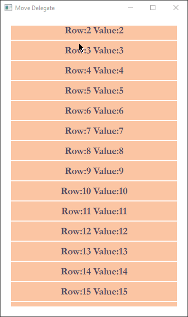
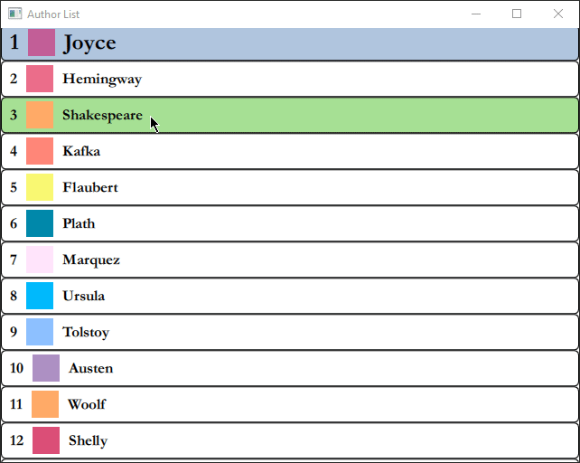
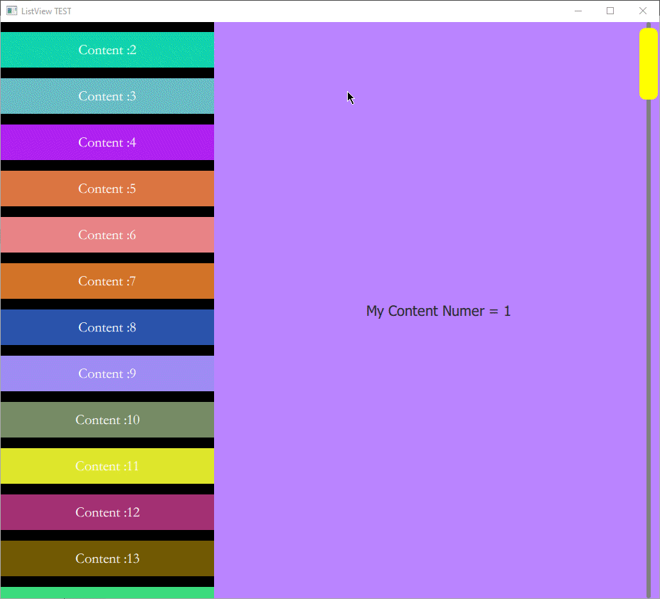
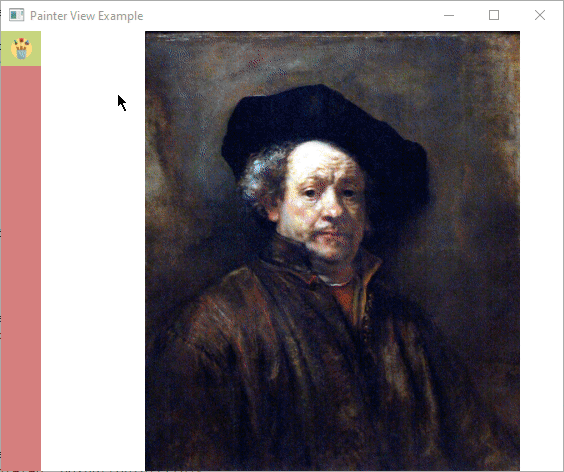

# QML-Views

In Qt Quick, we use "Views" to organize delegate and models when designing interfaces. Here are exercises related to this structure. Please review, modify and develop!

# Swipe View

# ListView Example 1

# ListView Example 2

# ListView Example 3

# Painter Menu

